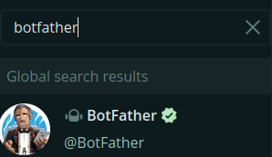
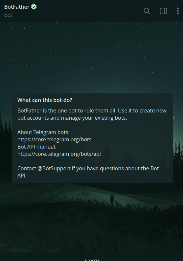
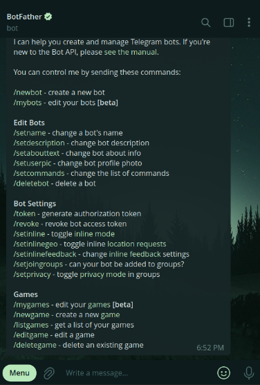
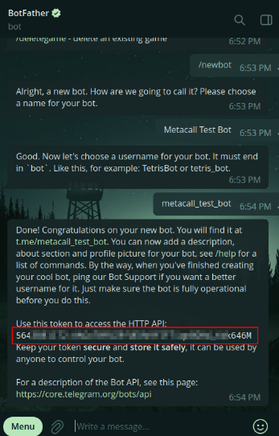

# Creating a Telegram Bot

Get started by creating a Telegram Bot. To do that go to your telegram client and search for @Botfather.

Go to the bot (Make sure that the username is the same) and press start. 

The bot will now send you a reply with all the things it can do.

Now send `/newbot` and follow the instructions as show.

You’ll get a Bot Token like this.

Yay! You've created our own Telegram Bot. You can then use this token to integrate our code with the Telegram bot

[Use Telegraf and configure functions for the Bot](../Using_Telegraf/Using_Telegraf.md)