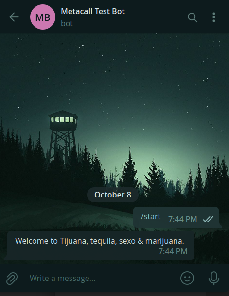

# Using Telegraf to configure functions for the Bot

In the previous part you've created a Bot via BotFather. Now you've to create a program using telegraf to configure functions for the Bot. You can check more about the things that you can do with telegraf [here](https://github.com/feathers-studio/telegraf-docs). But in this article we'll focus on a simple bot that replies with a Welcome message when started. 

Start by initializing the project and installing the dependencies. (For this you need to have npm installed)

```sh

# Creating a Directory 
mkdir metacall_test_bot

# Changing Directory
cd metacall_test_bot

# Installing Telegraf
npm install telegraf

# Installing TypeScript as a dev-dependency (optional, but recommended)
npm install --dev typescript

# Intializing TypeScript configuration
npx tsc --init

```

Now create a file with `.ts` (TypeScript File). For Eg. `metacall_test_bot.ts`. You can also write this script in JavaScript by using .js extension.

Now use the Code Editor of your choice and paste the following code (or replace this with the actual logic of your Bot).

```ts
import { Telegraf } from "telegraf";
import dotenv from "dotenv";
dotenv.config();

const bot = new Telegraf(process.env.BOT_TOKEN);
bot.start(ctx => {
    return ctx.reply(`Hello Welcome to Tijuana, tequila, sexo & marijuana.`);
  });
  
bot.launch();
```

This is a code which makes the bot reply with _'Welcome to Tijuana, tequila, sexo & marijuana.'_ when started with `/start` command in Telegram


